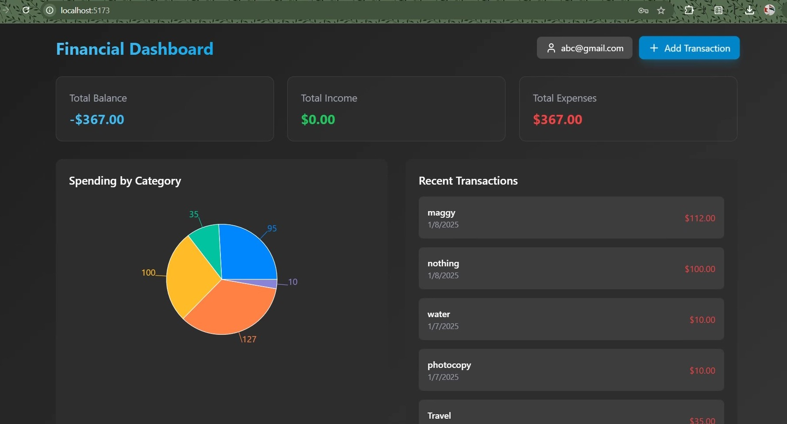
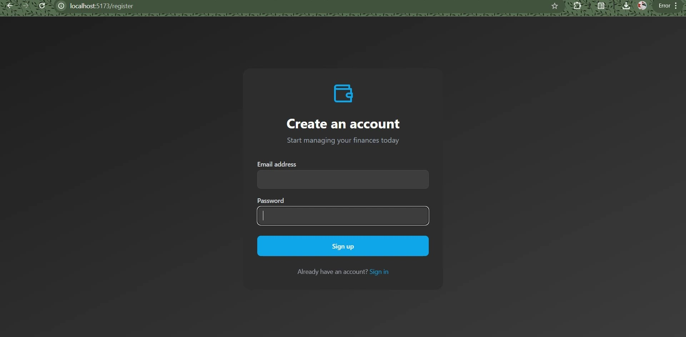
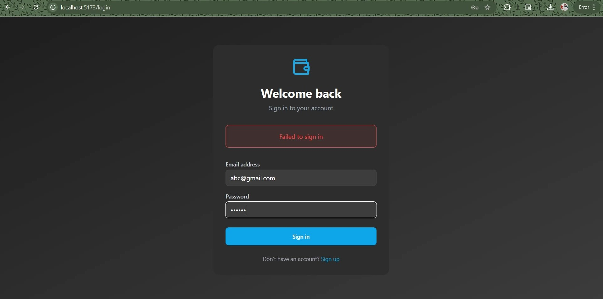
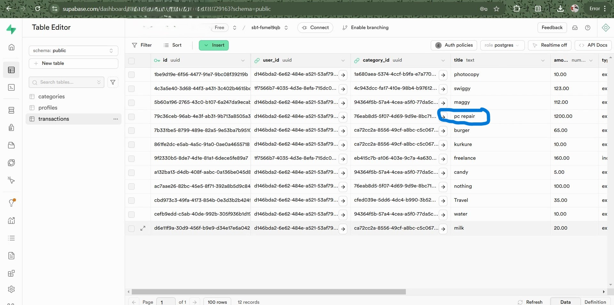

# Personal_Finance_Traker

A modern expense tracking application to help manage your personal finances effectively.






## Links

- 🚀 [Live Demo](https://personalfinnacetracker.netlify.app/login)
- 💻 [GitHub Repository](https://github.com/Shashiverm/Personal_Finance_Traker)
- 🎥 [Video Demo](https://youtu.be/demo-link)

## About the App

Expense Tracker is a web-based application that helps users track their daily expenses, manage budgets, and visualize spending patterns. It provides an intuitive interface for recording transactions and generating insightful financial reports.

## Tech Stack

- Frontend: React.js + vite
- Backend: Node.js with Express
- Database: supabase(PostgreSQL)
- Authentication: JWT
- Styling: CSS/SCSS/TAILWINDCSS
- Charts: Chart.js

## Features

- User account creation and authentication
- Add, edit, and delete expenses
- Categorize transactions
- Monthly budget setting
- Expense analytics and reports
- Responsive design for mobile and desktop
- Data export functionality

## Setup Instructions

1. Clone the repository
```bash
git clone https://github.com/Shashiverm/Personal_Finance_Traker
cd Personal_Finance_Traker
```

2. Install dependencies
```bash
npm install
```

3. Configure environment variables
- Create a `.env` file in the root directory
- Add necessary environment variables:
    ```
    MONGODB_URI=your_mongodb_connection_string
    JWT_SECRET=your_jwt_secret
    PORT=3000
    ```

4. Start the application
```bash
npm start
or
npm run dev
```

The application should now be running on `http://localhost:3000`
